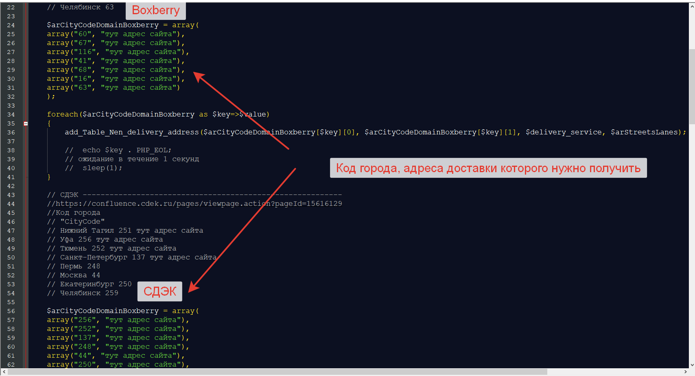
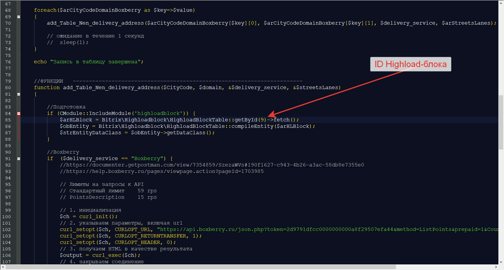
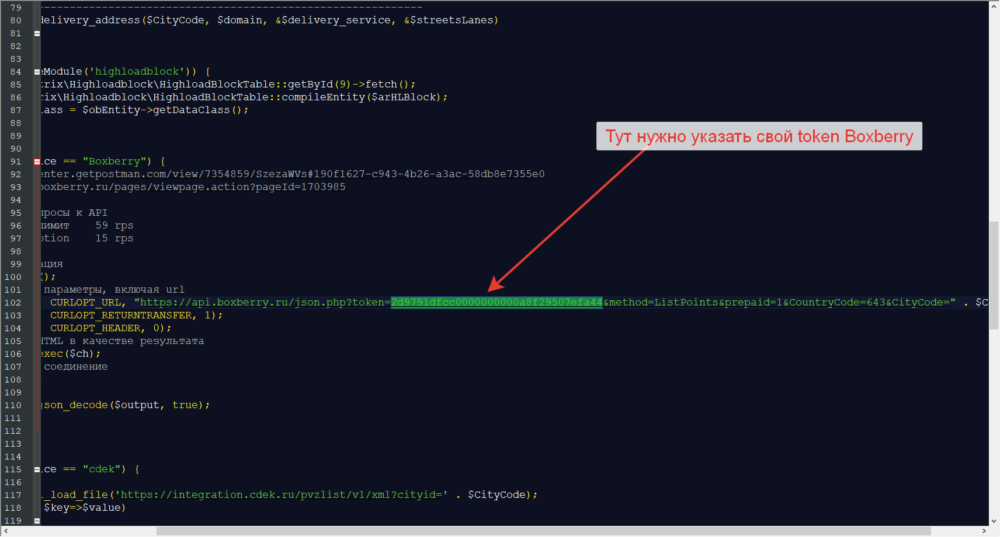
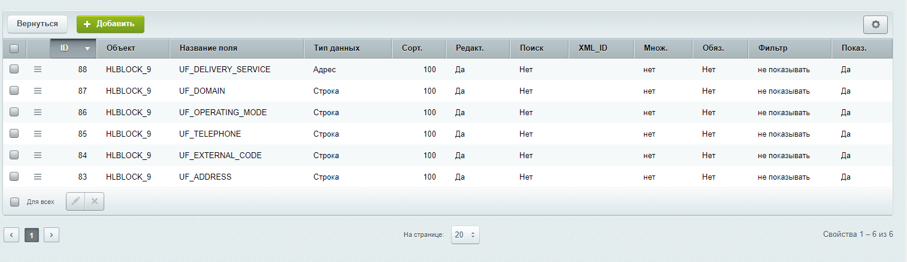

# Get Cdek and Boxberry addresses for 1C Bitrix
 Получить адреса доставки Cdek и доставки Boxberry для городов: Уфа, Тюмень, Санкт-Петербург, Пермь, Москва, Екатеринбург, Челябинск   

Скрипт получает адреса городов по API и записывает их в Highload-блок     

Установка:
Поместить файл get_Cdek_Boxberry_addresses.php в любое удобное место   

Настройка: 
1. Массив с кодами городов     
   

2. Нужно указать свой ID Highload-блока    
    

3. Нужно указать свой token Boxberry  
    

4. Назвать поля своего Highload-блока так же, как на кртинке или в файле Список полей для Highload-блока.xls  
   